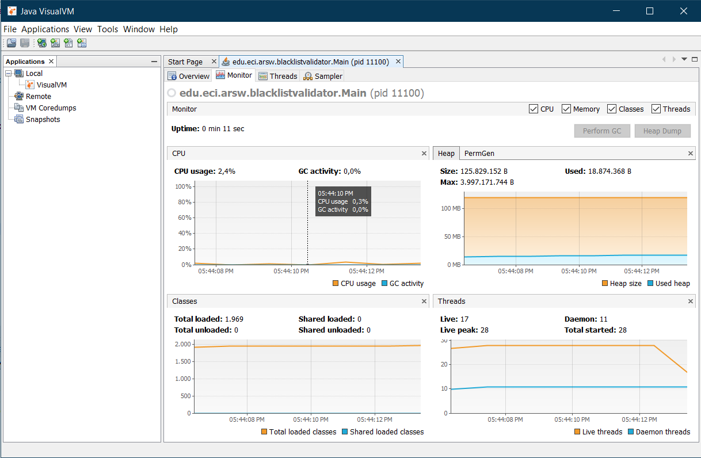

# Laboratorio 1

_Desarrollo y solución del laboratorio 1_

## Nombres:

* **Juan Carlos Alayon Molina**
* **Nicolas Medina Vargas**

## Parte I

_Salida al ejecutar con el comando start()_

_Salida al ejecutar con el comando run()_

Como se puede evidenciar en las imagenes anteriores al cambiar start() por run()
, se pasa de una ejecución paralela a una ejecución secuencial, ya que de la primera 
forma crea un nuevo hilo y como este se le asigna su propio escenario de ejecución, en este escenario 
llama a su metodo run() de una forma asincronica, por otro lado, de la segunda forma
lo que se hace es ejecutar el hilo de manera sincronica

## Parte III

Se obtuvieron los siguientes resultados de las validaciones que se realizaron 

_#Threads = 1_

_#Threads = 8_

_#Threads = 16_

_#Threads = 50_

_#Threads = 100_

Con los anteriores resultados se realizo una grafica, en la cual se determino que entre mas hilos se usen, menor es el tiempo de ejecucion

_Grafica de Numero de hilos vs tiempo_

